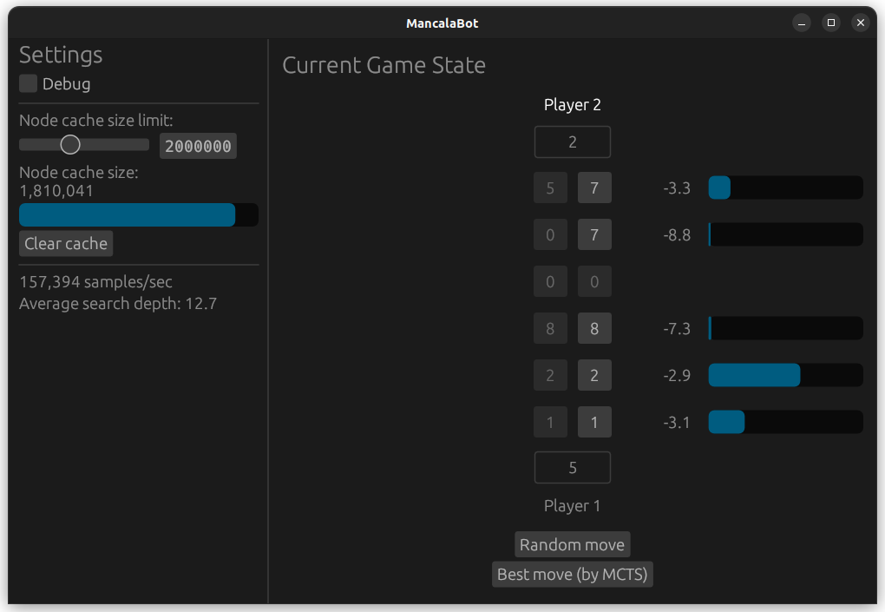

# mancala_bot

This is an AI that determines good moves in a variant of the board game Mancala. It uses [Monte Carlo tree search](https://en.wikipedia.org/wiki/Monte_Carlo_tree_search) with uniform random rollouts for leaf evaluation.

## How to run it

1. Make sure you have [Rust installed](https://www.rust-lang.org/tools/install).
2. Clone/download this repo, and go to it in a terminal.
3. Run `cargo run --release`
    - When run for the first time, this will automatically build the executable.

A background thread continuously performs Monte Carlo simulations from the current game state. The UI displays its evaluations of each of the possible moves, including the visit proportion (blue bars) and the estimated score for the current player.
